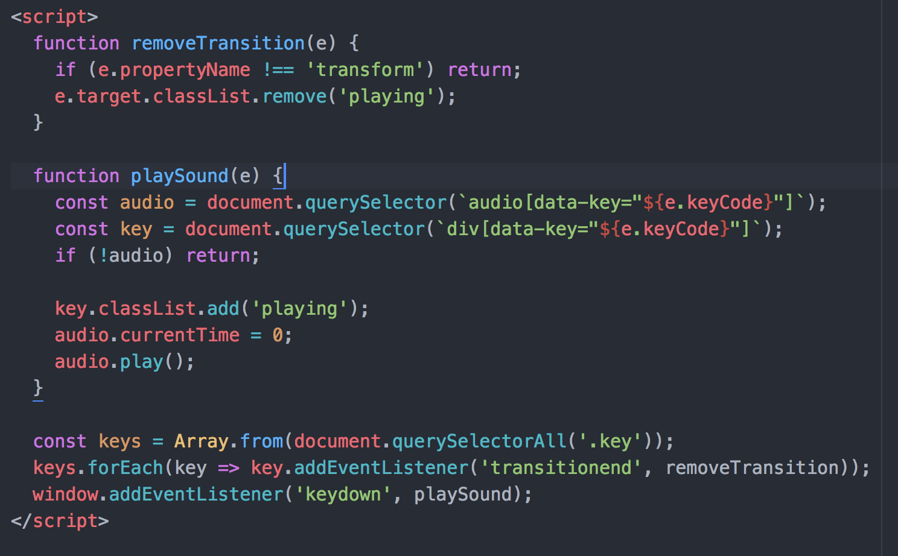
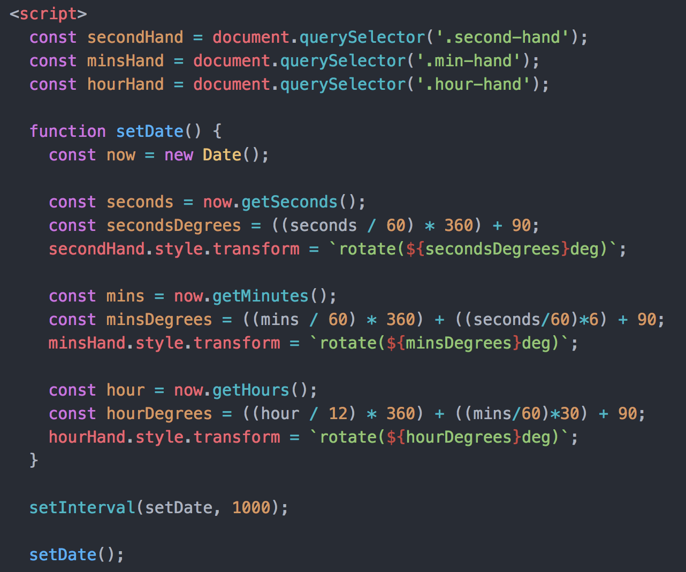
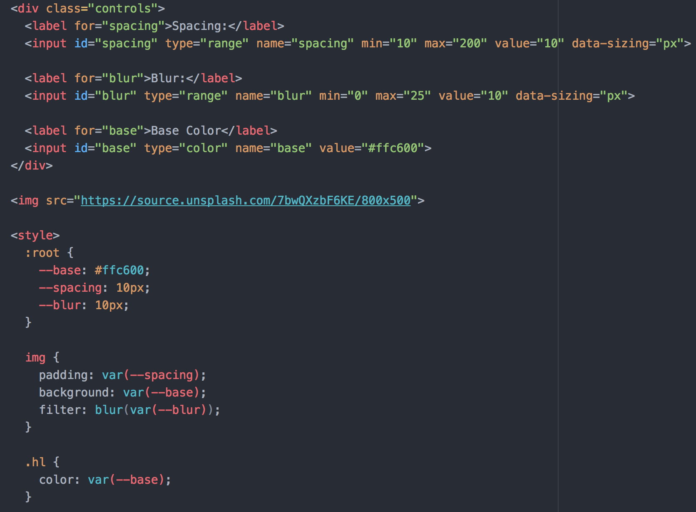
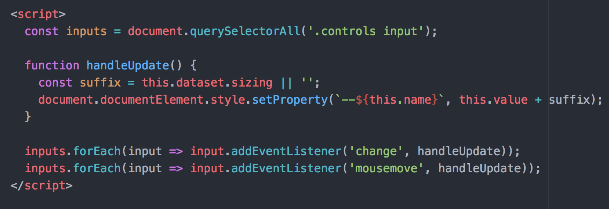

# Notes on JavaScript30

Notes as I work through the Wes Bos course.

Grab the course at [https://JavaScript30.com](https://JavaScript30.com)

### 01 - JavaScript Drum Kit


_addEventListener.(’__transitionend__’, removeTransition)_
+ On all divs with .key classes, listen for the _transition end_ and do a callback.

___e.propertyName___

+ All the properties that are transitioning.
Here just choosing the longest one associated with the div the transitions are taking place on.
+ _return_ allow instant ignore bc we only care about the longest one

_document.querySelector(__audio[data-key="${e.keyCode}"]__);_
_document.querySelector(__div[data-key=“${e.keyCode}"]__);_

+ Allows us to target just the first (here only) element of the type indicated and with the data attribute of the same value as the keyCode firing the event.

_if (!audio) __return__;_

+ Instant end if no audio element (a keyboard key without a reason to be considered).

_audio.__currentTime__ = 0;_

+ Prevents needing to wait until audio element finishes to fire a new _play()_ action.

#### Robert's solution
+ Breaks out the sound and styling operations into two distinct functions

### 02 - JS and CSS Clock



__const secondsDegrees = ((seconds / 60) * 360) + 90;__

+ Easy to logically follow at a glance

__setInterval__(setDate, 1000);

+ No need to add _window._ before hand

#### Robert's solution
+ Calls the minute and hour setters only when necessary rather than every second


### 03 - CSS Variables
(1)

(2)



__:root {
  --base: #ffc600;
  --spacing: 10px;
  --blur: 10px;
  }__

+ Declare CSS variables on _:root_

__filter: blur(var(--blur))__;

+ Filter style attribute on _img_ elements

inputs.forEach(input => input.addEventListener(__'mousemove'__, handleUpdate));

+ Even though the _inputs_ object is still a NodeList and not a proper array, can call _forEach_ on it
+ _mousemove_ event triggers anytime mouse hovers over element. Used here to handle dragging the sliders and updating the UI

__const suffix = this.dataset.sizing || '';__
__document.documentElement.style.setProperty(--${this.name}, this.value + suffix);__

+ Reaching into document to set the variable with the changed input's value

#### Robert notes
+ _mousemove_ seems to be calling JS to set the property unnecessarily. The variable value and thus UI is still only being updated once the value changes, but might be preferable to only trigger handleUpdate if mouse/touch down event is active.

### 04 - Array Cardio Day 1

const birthdateInventors = inventors.__filter__(inventor => (inventor.year >= 1500 && inventor.year < 1600));

+ Pass filter() a function with a test to implement on all items in an array. Returns new array with passing elements.

const fullNameInventors = inventors.__map__(inventor => `${inventor.first} ${inventor.last}`)

+ Pass map() a function and it will return a new array with the function executed on each element of the original array

const ordered = inventors.__sort__((a, b) => a.year > b.year ? 1 : -1);

+ Compares two items in an array and explicitly says a larger year should be sorted at a later index (returns greater than 0, or 1)

const totalYears = inventors.__reduce__((total, inventor) => {
  return total + (inventor.passed - inventor.year);
}__, 0__);

+ The second _initialValue_ parameter is key for a reliable reduce

const category = document.querySelector('.mw-category');
const links = Array.from(__category.querySelectorAll('a')__);
const de = links
            .map(link => __link.textContent__)
            .filter(streetName => __streetName.includes('de')__);

+ Nice demo of targeting via the console.
+ _querySelectorAll_ is getting called to further filter through the category results
+ I'd probably just write ```const category = document.querySelectorAll('.mw-category a');```
+ And use: ```[...category].map()```

const alpha = people.sort((lastOne, nextOne) => {
  __const [aLast, aFirst] = lastOne.split(', ')__;

+ Elegant munging into a two-index array via split

``` const data = ['car', 'car', 'truck', 'truck', 'bike', 'walk', 'car', 'van', 'bike', 'walk', 'car', 'van', 'car', 'truck' ]; ```

``` const transportation = data.reduce((obj, item) => {
  if (!obj[item]) {
    obj[item] = 0;
  }
  obj[item]++;
  return obj;
}, {}); ```

+ _reduce_ with an empty object as _initialValue_
+ Both adding up instances and constructing a data object

#### Robert solutions

const sortedInventors = inventors.__sort__((inventorA, inventorB) => inventorA.year - inventorB.year);

+ Sort can determine order based on any returned value greater than 0 or less than 0. In this case, simply testing if one year has a higher number than another _would at first seem_ preferable if a bit less transparent than explicitly returning -1 or 1.

+ YET, MDN indicates that not only do browsers have varying algorithms to execute sort, but "If _compareFunction_ is not supplied, elements are sorted by converting them to strings and comparing strings in Unicode code point order...because numbers are converted to strings, "80" comes before "9" in Unicode order."

+ At a minimum then, if I want to avoid the ternary and explicitly returning -1 vs 1, I'd need to pass in a basic _compareFunction_ as below:

``` var mixedNumericArray = ['80', '9', '700', 40, 1, 5, 200]; ```

``` function compareNumbers(a, b) {
  return a - b;
} ```

``` mixedNumericArray.sort(compareNumbers); ```

+ Bos's solution for (7) sort by last name is still a bit baffling to me. Since all the names start with their last name first and we're comparing strings, can't we simply run the default sort?
```const sortedPeople = people.sort();```
